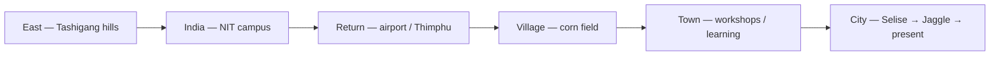

# Dorji Tshering — Interactive Journey

> **Tagline:** Anyone can learn anything — I learned between wild animals and slow Wi‑Fi.

Source of truth for story content: [STORY.md](./STORY.md)

---

## Purpose

This document defines how a visitor experiences the portfolio — not as a resume, but as an explorable journey through Bhutan and time. The goal is curiosity, emotional connection, and optional depth.

**Audience:** People who want to know Dorji and his journey. Not job seekers. No "hire me" funnel.

**Core theme:** *Anyone can learn anything.*

---

## Locked design decisions

| Area | Choice |
|------|--------|
| World metaphor | **Path through Bhutan** — mountains → village → city |
| Visual style | **3D low-poly world** — Bruno Simon–level craft; mobile must feel smooth when implemented well |
| Opening tone | **Cinematic and quiet** — stars, slow reveal, no immediate UI chrome |
| Blog | **Both** — teaser/archive in-world; full posts at `/blog` |
| Tagline | Anyone can learn anything — I learned between wild animals and slow Wi‑Fi. |
| Locomotion | **Vehicle + dismount** — low-poly mountain jeep on path; auto-dismount in interior acts |
| Sound | **Ambient bed + act accents** — mute toggle; auto-mute with `prefers-reduced-motion` |
| Say hi | **Postcard rack** on final overlook — X (primary), GitHub, Facebook |
| Lite fallback | **Prompt on struggle; auto only if WebGL fails** — see thresholds below |
| Blog teasers | **Latest 3 posts** in Act VI terminal + always "View all → `/blog`" |

---

## Experience principles

1. **Guided path + free exploration** — Story always progresses; objects reward curiosity.
2. **No fail states** — Exploration, not difficulty.
3. **Three content layers** — Ambient (mood) → Discoverable (2–4 sentences) → Deep lore (optional modal).
4. **Humor through objects** — Deadpan lore on interactables, not joke buttons.
5. **Performance is part of the story** — Smooth motion signals craft; jank breaks immersion.

---

## World structure

A single continuous **path through Bhutan**, geographically and chronologically:

The visitor drives a low-poly **mountain jeep** along the path and **dismounts** in tight interior zones. Each zone is an **act** tied to a life chapter. The environment morphs; the path does not fork permanently.

---

## Opening — first 30 seconds

**Tone:** Cinematic, quiet, cosmic.

| Time | What happens |
|------|----------------|
| 0–5s | Dark sky, stars, faint drifting equations. Optional low ambient hum. Text: *"What if nothing mattered?"* |
| 5–15s | Subtle prompt: *"Look around"* / *"Tap to continue"*. Stars drift; a constellation loosely suggests Bhutan. |
| 15–30s | Name fades in: **Dorji Tshering**. Tagline appears. No nav bar — immersion first. |

**Desktop:** Mouse to look; scroll or click to advance.
**Mobile:** Touch-drag to look; tap to advance.

---

## Acts — six chapters, ten defining moments

### Act I — Night classroom (High school · 2016)

**Zone:** Tashigang hills, small school building under stars.

**Story beats:**
- School topper, 4 HM certificates
- Physics and math; no idea what coding is
- Cosmologist dreams; existential questions that exhausted friends

**Defining moment #1:** Existential cosmologist kid.

**Interactables:**
- Glowing physics notebook → discoverable lore
- Certificates on wall → HM excellence detail
- Friends on bench → cosmology speech snippet

**Mood:** Curious, vast, slightly melancholic.

---

### Act II — Campus green (College · 2017–2019)

**Zone:** NIT Kurukshetra — open field, dorm silhouettes, warmer palette.

**Story beats:**
- Government scholarship, mechanical engineering
- Football team, Inter-NIT tournament in Goa

**Defining moment #2:** Football / Goa joy.

**Interactables:**
- Football — kick or tap; short Goa postcard Easter egg
- Scholarship letter
- Dorm window with laughter audio (optional)

**Mood:** Light, social, last chapter of ease.

---

### Act III — Storm and return (Dropout · 2019)

**Zone:** Weather shifts on campus → airport → flight path toward Bhutan.

**Story beats:**
- Psychological struggle; wave of hopelessness
- Friends fund airfare home
- Break; uncertainty about what comes next

**Defining moments #3–4:**
- **#3** Friends fund the flight — ticket object, names optional/abstractions
- **#4** His Majesty's National Day speech, **17 December 2019** — radio/screen activates; path forward lights up

**Interactables:**
- Airplane ticket
- Radio / broadcast screen — speech excerpt (discoverable, not full transcript)
- Window with rain/storm shader transition

**Mood:** Heavy → warmth → hope. Handle mental health with respect; no jokes in this act.

---

### Act IV — Corn field (Choosing coding · May–Sep 2020)

**Zone:** Village Bhutan — corn rows, makeshift shelter, mountains behind.

**Story beats:**
- C and matrix multiplication (Easter egg: "just for loops")
- Head First PDFs, Java, HTML/CSS/JS
- Bhutan yearly calendar replicated and shared on Facebook
- Whole days in shelter: guard field from wild animals + code on Windows laptop (Mac now — subtle then/now detail)

**Defining moments #5–6:**
- **#5** Corn field + wild animals + slow internet — **signature scene of the entire site**
- **#6** Calendar shared to Bhutanese Facebook group — visual unlock / achievement moment

**Interactables:**
- Laptop with slow loading bar on "compile" or "save"
- Calendar on screen — expands to show design
- Corn rustle + distant animal sound (ambient)
- Head First book stack

**Mood:** Grit, charm, obsession. Peak emotional identity.

---

### Act V — The long middle (2020–2023)

**Zone:** Small town path — workshop posters, café table with laptop, job application papers.

**Story beats:**
- Still learning
- Applying for jobs here and there
- IT workshops whenever possible

**Interactables:**
- Workshop flyer stack
- Rejection/apply loop (gentle, not gamified failure)
- Terminal with practice problems

**Mood:** Persistence, quiet grind. Bridge between village and professional life.

---

### Act VI — The build (2023 → present)

**Zone:** Urban Bhutan — office interiors abstracted as explorable rooms along the city path.

#### Room 1 — Selise (April 2023)

**Defining moment #7:** Coding test — honest comment gets the interview (AI cheaters Easter egg).

**Defining moment #8:** Migros portal — Angular 19 learned on the go.

**Interactables:**
- Test terminal with timer; comment line readable on interact
- Portal mock UI panel

#### Room 2 — Jaggle.AI (October 2025 → now)

**Defining moment #9:** Custom high-performance Gantt chart.

**Story beats:**
- GNH-guided project management platform
- Growing into frontend lead: PRs, patterns, licenses, tech landscape
- Startup risk — building something and watching it succeed

**Interactables:**
- Gantt demo — scroll/zoom performance showcase
- PR review terminal (lore)
- GNH motif — subtle, respectful

#### Room 3 — Future wing

**Defining moment #10:** split.dorji.dev side quest.

**Story beats:**
- Performance obsession (1000-card kanban lore)
- What you love: clean code, no bloat, custom implementations
- Tech stack display as discoverable objects, not a list wall
- Exploring: Go, Rust, AI/ML

**Interactables:**
- split.dorji.dev receipt object → real outbound link
- Kanban stress-test panel (demo or lore)
- Stack items as physical objects on desk

**Mood:** Craft, momentum, "you are here."

---

## End state

After Act VI, the path opens to a quiet overlook (mountains or city lights).

**Closing line:** *Anyone can learn anything.*

**Soft CTAs (no recruitment):**
- Blog archive (in-world terminal → `/blog`)
- split.dorji.dev (receipt object in Act VI)
- **Postcard rack** — say hi without a recruiter funnel (see below)

**Postcard rack (say hi):**

A mailbox or postcard stand on the final overlook holds three stamped cards:

| Card | Link | Role |
|------|------|------|
| **X** | [x.com/DorjiBolt](https://x.com/DorjiBolt) | Primary — casual hello |
| **GitHub** | [github.com/dorji-dev](https://github.com/dorji-dev) | For devs who want code |
| **Facebook** | [facebook.com/share/1CmMsS1W82](https://www.facebook.com/share/1CmMsS1W82/) | Secondary social |

Copy hint on interact: *"No recruiters, just hello."*

**Replay:** "Explore again" resets to Act I or unlocks free-roam on completed path.

---

## Blog integration (decision 4C)

| Layer | Behavior |
|-------|----------|
| **In-world** | Terminal in Act VI — shows **up to 3** most recent post titles + 1-line teasers |
| **`/blog`** | Classic MDX blog (existing stack) — full posts, comments, reading time |
| **Linking** | Teasers in 3D link to `/blog/[slug]`; `/blog` has minimal branded header back to journey |
| **Few posts** | Show however many exist if fewer than 3; **"View all posts →"** always links to `/blog` |

The journey sells curiosity; the blog satisfies depth.

---

## Locomotion — vehicle + dismount

**Default:** Low-poly **mountain jeep / pickup** on the open path (Bhutan road-trip feel — not a circus buggy).

**Auto-dismount zones** — visitor exits the jeep and moves on foot in bounded areas:

| Act | Why on foot |
|-----|-------------|
| **I** | Night classroom interior |
| **IV** | Corn-field makeshift shelter |
| **VI** | Office rooms (Selise, Jaggle, future wing) |

**Re-mount:** Jeep waiting at zone exit; path driving resumes automatically.

| Platform | Look | Driving | On foot | Interact |
|----------|------|---------|---------|----------|
| **Desktop** | Mouse drag | WASD / arrow keys | WASD in bounded interior | Click objects |
| **Mobile** | Touch drag | Virtual wheel or touch-drag steer | Tap-to-move or simplified stick | Tap objects |

**Constraints:**
- Visitor cannot get lost off-path permanently
- Camera bounds per act
- Large touch targets (min 44px equivalent)
- Mobile: lower max speed, larger steer touch zone

---

## Content layers (per interactable)

1. **Ambient** — Animation, sound, lighting (no copy required)
2. **Discoverable** — 2–4 sentences on first interact
3. **Deep lore** — "Read more" pulls from [STORY.md](./STORY.md) sections

Humor lives in layers 2–3. Mental health jokes only where STORY.md allows — past tense, strength-forward.

---

## Sound design

**Scope:** Ambient bed + light act accents — not full unique music per act.

| Layer | Behavior |
|-------|----------|
| **Global ambient** | Quiet loop (wind, distant tone); optional; off by default on first visit |
| **Act accents** | I: silence/stars · II: campus air · III: storm/rain · IV: corn rustle + distant animals · V: café murmur · VI: soft office hum |
| **Interactables** | Short one-shots — radio click, calendar chime, terminal keystroke |
| **Mute toggle** | Always visible in DOM overlay |
| **Reduced motion** | `prefers-reduced-motion: reduce` → auto-mute + offer lite path |

Sound supports mood; it never blocks story progression.

---

## Lite-path fallback

**Lite path** = pre-rendered act snapshots + DOM lore panels (same story, no live 3D).

| Trigger | Action |
|---------|--------|
| WebGL unavailable or context lost | **Auto-lite** immediately |
| `navigator.hardwareConcurrency < 4` **and** mobile | **Suggest** lite on first load |
| FPS **< 30 for 3 consecutive seconds** | Non-blocking banner: *"Switch to lite experience?"* |
| `prefers-reduced-motion: reduce` | Offer lite + auto-mute |
| User chooses "Lite mode" in settings | Manual toggle anytime |

**Do not auto-lite** on capable phones — full 3D remains the default when performance is acceptable.

---

## Visual direction — 3D low-poly

**Reference:** [Bruno Simon](https://bruno-simon.com) — playful 3D world, driving/exploring, polished feel on desktop.

**Style notes:**
- Low-poly Bhutan geography — mountains, dzong silhouettes, village fields, city blocks
- Warm act palettes: cool stars → green campus → gray storm → golden corn → neutral grind → sharp city
- Consistent character scale — low-poly mountain jeep on path; on-foot avatar in dismount zones

**Mobile performance strategy (non-negotiable):**
- Cap `devicePixelRatio` (e.g. max 1.5 on mobile)
- Lazy-load acts — unload previous zone geometry
- Instanced meshes for repeated objects (corn, trees)
- Reduced shadow quality on mobile; baked lighting where possible
- Touch-optimized UI overlays in DOM, not 3D text
- Detect low-end devices → lite path per thresholds above
- Target 60fps on mid-range phones; 30fps floor with graceful degradation

---

## Symbols & objects (recurring)

| Symbol | Acts |
|--------|------|
| Stars / cosmos | I |
| Football | II |
| Airplane ticket | III |
| Radio / broadcast | III |
| Corn + shelter + laptop | IV |
| Calendar page | IV |
| Test terminal + comment | VI |
| Gantt bars | VI |
| Receipt (split) | VI |
| Mountain jeep | Path (all acts) |
| Postcard rack | End overlook |
| Certificates + laptop | I, IV, VI |

---

## What we are not building

- A game with scores, lives, or fail screens
- A recruiter landing page
- A single-page scroll resume with 3D wallpaper
- Identical desktop/mobile scenes at full fidelity

---

## Implementation phases (pointer to Phase 3)

| Phase | Scope |
|-------|-------|
| **3a — Foundation** | R3F canvas, jeep locomotion + dismount, Act I opening, mobile DPR cap |
| **3b — Story acts** | Acts I–IV (core narrative + corn field) |
| **3c — Professional** | Acts V–VI, blog terminal (3 teasers), postcard rack |
| **3d — Polish** | Sound accents, Easter eggs, lite fallback, replay |

Library choices and full implementation details: [TECH_PLAN.md](./TECH_PLAN.md) (Yarn for all package installs).

---

## Success criteria

A visitor can:
1. Understand who Dorji is within 2 minutes without reading a wall of text
2. Feel the emotional arc: curiosity → joy → struggle → hope → grit → craft
3. Optionally deep-dive any chapter via interactables
4. Reach split.dorji.dev or blog naturally, not via a menu barrage
5. Experience smooth motion on a modern phone (no persistent jank)

---

## Phase 2 — Locked ✓

All open items resolved:

- [x] **Locomotion** — Vehicle + dismount (mountain jeep; on foot in Acts I, IV, VI interiors)
- [x] **Sound** — Ambient bed + act accents; mute toggle; reduced-motion auto-mute
- [x] **Say hi** — Postcard rack: X (primary), GitHub, Facebook
- [x] **Lite fallback** — Auto on WebGL failure; prompt on sustained low FPS or weak mobile; manual toggle
- [x] **Blog teasers** — Latest 3 in Act VI terminal + always "View all → `/blog`"

**Next:** Sprint 3a — see [TECH_PLAN.md](./TECH_PLAN.md). Reply `start 3a` when ready to implement.
