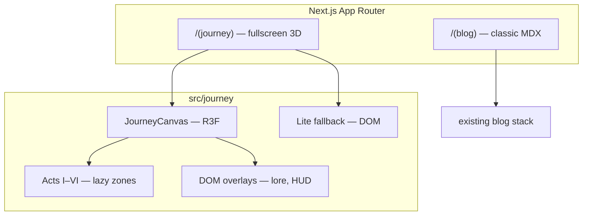

# Phase 3 — Tech Plan

Source docs: [JOURNEY.md](./JOURNEY.md) · [STORY.md](./STORY.md)

**Package manager:** [Yarn](https://yarnpkg.com) — use `yarn` for all installs and scripts, not `npm`.

---

## Architecture overview



**Rule:** `/` = immersive journey (no header/footer). `/blog` = readable posts with a minimal “back to journey” link.

---

## Library stack

### Core 3D (required)

| Package | Purpose |
|---------|---------|
| `three` | WebGL engine |
| `@react-three/fiber` | React renderer for Three.js |
| `@react-three/drei` | Camera, controls, `Html`, `Instances`, `useGLTF`, `Environment`, `PerformanceMonitor` |
| `zustand` | Journey state (act, drive/walk mode, mute, lite mode, interactable focus) |

### Locomotion

| Package | Purpose |
|---------|---------|
| `@react-three/rapier` | Jeep physics on terrain (Bruno-style driving) — add in Sprint 3b |

**Sprint 3a:** Kinematic jeep on a spline first (no physics). Add Rapier in 3b if driving feels flat.

### Input & UI

| Package | Purpose |
|---------|---------|
| `@use-gesture/react` | Touch steer, drag-to-look on mobile |
| `framer-motion` | Already installed — opening text, lore panels, lite UI |

**Skip for now:** GSAP — add only if camera choreography outgrows drei + framer-motion.

### Audio

| Package | Purpose |
|---------|---------|
| `howler` | Ambient loops, act accents, one-shots; mute toggle |

### Performance & detection

| Package | Purpose |
|---------|---------|
| `detect-gpu` | Tier detection for lite-path suggestion on load |

Use drei `PerformanceMonitor` for sustained FPS &lt; 30 → lite prompt.

### Post-processing (optional, desktop only — Sprint 3d)

| Package | Purpose |
|---------|---------|
| `@react-three/postprocessing` | Subtle bloom/vignette on desktop; **off on mobile** |

### Dev tooling (not shipped)

| Tool | Purpose |
|------|---------|
| `leva` | Debug camera, jeep speed, act boundaries (dev only) |
| `gltfjsx` | Generate typed React components from `.glb` |
| `@gltf-transform/cli` | Draco/meshopt compression |

### Keep from current stack

- `next`, `next-mdx-remote`, blog libs — `/blog` unchanged
- `tailwindcss` — all HUD, lore modals, lite path
- `next-themes` — optional for blog; journey has its own act palettes

---

## Install commands (Yarn)

### Sprint 3a

```bash
yarn add three @react-three/fiber @react-three/drei zustand @use-gesture/react howler detect-gpu
yarn add -D @types/three @types/howler
```

### Sprint 3b

```bash
yarn add @react-three/rapier
```

### Sprint 3d

```bash
yarn add @react-three/postprocessing
```

### Dev tooling (as needed)

```bash
yarn add -D leva @gltf-transform/cli
```

---

## Folder structure

```
src/
├── app/
│   ├── (journey)/
│   │   ├── layout.tsx          # fullscreen, no header/footer
│   │   └── page.tsx            # dynamic JourneyScene import
│   ├── (blog)/
│   │   ├── layout.tsx          # narrow column + back-to-journey
│   │   └── blog/               # move existing blog routes here
│   ├── globals.css
│   └── layout.tsx              # root — fonts, metadata only
│
├── journey/
│   ├── index.tsx               # JourneyScene entry (client)
│   ├── canvas/
│   │   ├── JourneyCanvas.tsx   # R3F Canvas wrapper, dpr, suspense
│   │   ├── Lighting.tsx
│   │   └── PerformanceGate.tsx # FPS watch, lite prompt
│   ├── acts/
│   │   ├── ActRouter.tsx       # mounts/unmounts active act
│   │   ├── act-1-classroom/
│   │   ├── act-2-campus/
│   │   ├── act-3-storm/
│   │   ├── act-4-cornfield/
│   │   ├── act-5-grind/
│   │   └── act-6-build/
│   ├── locomotion/
│   │   ├── Jeep.tsx
│   │   ├── OnFootController.tsx
│   │   └── PathSpline.tsx
│   ├── interactables/
│   │   ├── Interactable.tsx    # base hover/tap + lore trigger
│   │   └── LorePanel.tsx       # DOM overlay (framer-motion)
│   ├── ui/
│   │   ├── OpeningSequence.tsx
│   │   ├── Hud.tsx             # mute, lite toggle
│   │   ├── LiteJourney.tsx     # snapshot + DOM fallback
│   │   └── BlogTerminal.tsx    # 3d + DOM hybrid
│   ├── audio/
│   │   └── AudioManager.ts     # howler singleton
│   ├── state/
│   │   └── journey-store.ts    # zustand
│   ├── hooks/
│   │   ├── useActProgress.ts
│   │   └── useDeviceTier.ts
│   └── data/
│       └── lore.ts             # maps interactable IDs → STORY.md excerpts
│
├── components/                 # existing blog/footer pieces (blog route)
├── lib/                        # blog.ts, etc.
└── public/
    └── journey/
        ├── models/             # .glb (jeep, props) — compressed
        ├── textures/
        ├── audio/
        └── lite/               # act snapshot images for fallback
```

Follow [`.cursor/rules/react.mdc`](.cursor/rules/react.mdc): feature folder per act, one default export per file, DOM UI separate from 3D.

---

## App routing

| Route | Layout | Content |
|-------|--------|---------|
| `/` | `(journey)/layout` — `100dvh`, no max-width | Fullscreen canvas |
| `/blog` | `(blog)/layout` — minimal nav | Existing blog |
| `/blog/[slug]` | same | Existing posts |

**Critical pattern:**

```tsx
// app/(journey)/page.tsx
const JourneyScene = dynamic(() => import("@/journey"), { ssr: false });
```

Never SSR the WebGL canvas.

---

## Performance strategy

| Technique | Sprint |
|-----------|--------|
| `dpr={[1, 1.5]}` on mobile, `[1, 2]` desktop | 3a |
| Lazy-load acts — mount only active ±1 | 3b |
| `Instances` for corn, trees, repeated props | 3b (Act IV) |
| Draco/meshopt compressed `.glb` | Per asset |
| Baked lighting / light probes; reduced shadows on mobile | Per act |
| DOM lore via drei `Html` or fixed overlay — not 3D text | 3a |
| `detect-gpu` + `PerformanceMonitor` | 3a |
| Lite path (`LiteJourney.tsx`) | 3d |
| Post-processing | 3d, desktop only |

---

## State model (zustand)

```ts
type JourneyStore = {
  act: 1 | 2 | 3 | 4 | 5 | 6 | "end";
  locomotion: "jeep" | "on-foot";
  phase: "opening" | "playing" | "paused";
  muted: boolean;
  liteMode: boolean;
  activeInteractable: string | null;
  // actions: setAct, enterInterior, exitInterior, toggleMute, enableLite...
};
```

---

## Build sprints

### Sprint 3a — Foundation

**Goal:** Visitor lands on `/`, sees cinematic opening, drives a placeholder jeep on a path stub.

| # | Task |
|---|------|
| 1 | `yarn add` core deps (see Install commands) |
| 2 | Route groups: `(journey)` fullscreen + `(blog)` with back link |
| 3 | `JourneyCanvas` — dynamic import, `dpr` cap, Suspense fallback |
| 4 | `OpeningSequence` — DOM stars + tagline |
| 5 | Placeholder terrain + path spline |
| 6 | Jeep mesh (box → glb later) + basic drive controls |
| 7 | `journey-store` + `PerformanceGate` + `detect-gpu` suggestion |
| 8 | `Hud` — mute button (howler stub), lite toggle placeholder |
| 9 | One sample `Interactable` + `LorePanel` proving the pattern |

**Exit criteria:** 60fps on desktop; mobile loads without crash; opening → drive → interact with one object.

---

### Sprint 3b — Story acts I–IV

| # | Task |
|---|------|
| 1 | Act I classroom (dismount, interior bounds) |
| 2 | Act II campus + football interactable |
| 3 | Act III storm transition + radio/ticket |
| 4 | Act IV corn field — signature scene (instances, slow-load Easter egg) |
| 5 | `lore.ts` wired to STORY.md excerpts |
| 6 | Act lazy loading + unload previous geometry |
| 7 | `yarn add @react-three/rapier` + jeep physics |

---

### Sprint 3c — Acts V–VI + integrations

| # | Task |
|---|------|
| 1 | Act V grind zone |
| 2 | Act VI rooms — Selise terminal, Jaggle Gantt lore, stack objects |
| 3 | `BlogTerminal` — latest 3 from `lib/blog.ts` |
| 4 | split.dorji.dev receipt interactable |
| 5 | End overlook + postcard rack (X, GitHub, Facebook) |

---

### Sprint 3d — Polish

| # | Task |
|---|------|
| 1 | Howler act accents |
| 2 | Lite path snapshots + `LiteJourney` |
| 3 | Easter eggs (matrix multiplication, AI cheaters comment) |
| 4 | Replay / explore again |
| 5 | Desktop post-processing (`yarn add @react-three/postprocessing`) |
| 6 | Blog layout polish — back to journey |

---

## Asset pipeline

1. **Blockout** in Three.js with primitives (boxes, planes).
2. **Model** low-poly assets in Blender — jeep, shelter, classroom, key props.
3. **Export** `.glb` → compress with `@gltf-transform/cli`.
4. **Generate** `npx gltfjsx model.glb -o src/journey/assets/Jeep.tsx`.
5. **Textures** — max 1024px mobile assets; KTX2 if needed later.

Sprint 3a uses **primitives only** — no Blender blocker.

---

## Current homepage migration

| Component | Fate |
|-----------|------|
| `hero`, `about`, `repos` | Retire from `/` (keep files until 3b, then remove) |
| `header` / `footer` | Blog layout only |
| `blog/*` | Move under `(blog)` route group |
| `repos` | Optional Act VI GitHub lore or drop |

---

## Risks & mitigations

| Risk | Mitigation |
|------|------------|
| Mobile jank | DPR cap, act lazy loading, lite path |
| Bundle size | Dynamic import journey chunk; tree-shake drei imports |
| Scope creep | Ship 3a before Blender assets |
| Blog regression | Route group isolation; blog unchanged functionally |
| React 19 + R3F | Use `@react-three/fiber` v9 (React 19 compatible) |

---

## Scripts

Use existing Yarn scripts — no change required:

```bash
yarn dev      # local development
yarn build    # production build
yarn start    # production server
yarn lint     # eslint
```

---

## Phase 3 — Locked ✓

- [x] Stack: R3F + drei + zustand + howler + detect-gpu
- [x] Locomotion: kinematic jeep (3a) → Rapier (3b)
- [x] Routing: `(journey)` + `(blog)` route groups
- [x] Package manager: **Yarn**
- [x] Sprints: 3a → 3b → 3c → 3d

**Next:** Sprint 3a implementation — reply `start 3a` when ready.
